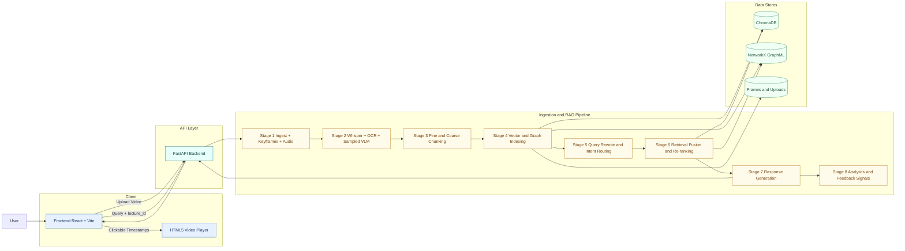

# multimodal-rag

## System Architecture


## Technology Stack
### Frontend
- React + Vite
- Axios for API communication
- Native HTML5 video player with timestamp seeking

### Backend
- FastAPI + Pydantic
- faster-whisper for speech transcription
- OpenCV + SSIM for keyframe extraction
- pytesseract for OCR
- Ollama or Gemini for LLM and vision tasks

### Retrieval and Storage
- sentence-transformers embeddings
- ChromaDB for vector search
- NetworkX GraphML for concept relationships

### Runtime
- Python 3.11+
- Node.js 20+

## Project Summary
Multimodal RAG system for lecture videos.

The system ingests a lecture video, extracts transcript and visual signals (OCR + sampled visual LLM), indexes them in vector and graph structures, and answers questions with grounded timestamped clips. The frontend allows direct seeking by clicking returned timestamps.

## Architecture (8 Stages)
1. Ingestion and preprocessing (audio extraction + keyframes)
2. Multimodal extraction (Whisper, OCR, sampled VLM)
3. Fine/coarse chunking and metadata attachment
4. Indexing in ChromaDB + concept graph build
5. Query rewrite + intent routing + temporal anchor handling
6. Retrieval, fusion, filtering, scoring, re-ranking
7. Response generation (QA, summaries, quiz)
8. Analytics (confusion and recommendation signals)

## Repository Layout
```text
backend/     FastAPI service and all pipeline stages
frontend/    React + Vite client
data/        Chroma DB, graphs, extracted frames
uploads/     Uploaded lecture files
```

## Prerequisites
- Python 3.11+
- Node.js 20+
- FFmpeg available on PATH
- Tesseract OCR installed
- Ollama (optional but recommended for local LLM mode)

## Setup
### 1) Backend
```powershell
python -m venv venv
.\venv\Scripts\Activate.ps1
pip install -r requirements.txt
python -m spacy download en_core_web_sm
```

### 2) Frontend
```powershell
cd frontend
npm install
cd ..
```

### 3) Environment Configuration
1. Copy .env.example to .env
2. Fill values as needed

## Ollama Models to Download
If using LLM_PROVIDER=ollama, pull at least one chat model and one vision model.

Recommended default (balanced):
```powershell
ollama pull llama3.1:8b
ollama pull moondream:latest
```

Alternative stronger chat model:
```powershell
ollama pull llama3.2:latest
```

Then ensure these environment values match:
- OLLAMA_CHAT_MODEL=llama3.1:8b
- OLLAMA_VISION_MODEL=moondream:latest

## Run
### Start backend
```powershell
cd backend
uvicorn main:app --reload --port 8000
```

### Start frontend
```powershell
cd frontend
npm run dev
```

URLs:
- Frontend: http://localhost:5173
- Backend: http://localhost:8000

## Testing
```powershell
python -m pytest backend/tests/test_pipeline.py -q
```

## Key Runtime Controls
- LLM_PROVIDER: gemini or ollama
- VISUAL_LLM_BUDGET_MODE: adaptive, fixed, or off
- VISUAL_LLM_MAX_FRAMES: upper bound for VLM calls
- VISUAL_LLM_MIN_FRAMES: lower bound in adaptive mode
- VISUAL_LLM_FRAME_RATIO: % of visual frames in adaptive mode
- VISUAL_LLM_MAX_PER_MIN: VLM calls per minute cap in adaptive mode

## Troubleshooting
1. Hugging Face warning about unauthenticated requests
- Informational only.
- Set HF_TOKEN to improve rate limits and download speed.

2. sentence-transformers UNEXPECTED key notice
- Informational in this project setup and typically safe.

3. Slow ingestion
- Lower VISUAL_LLM_FRAME_RATIO or set VISUAL_LLM_BUDGET_MODE=fixed with a smaller VISUAL_LLM_MAX_FRAMES.
- Ensure Ollama service is running if using local mode.

4. No answers for a query
- Re-upload lecture after changing pipeline config.
- Confirm lecture_id is being sent from frontend (already wired in this repo).

## Current Implementation Notes
- Retrieval is scoped to active lecture_id to avoid cross-lecture leakage.
- Course ID is optional in UI/API; when omitted, backend defaults to `general` at ingest.
- Timestamp cards in chat seek the video player directly.
- Coarse-only timestamp pollution is filtered when fine clips exist.
